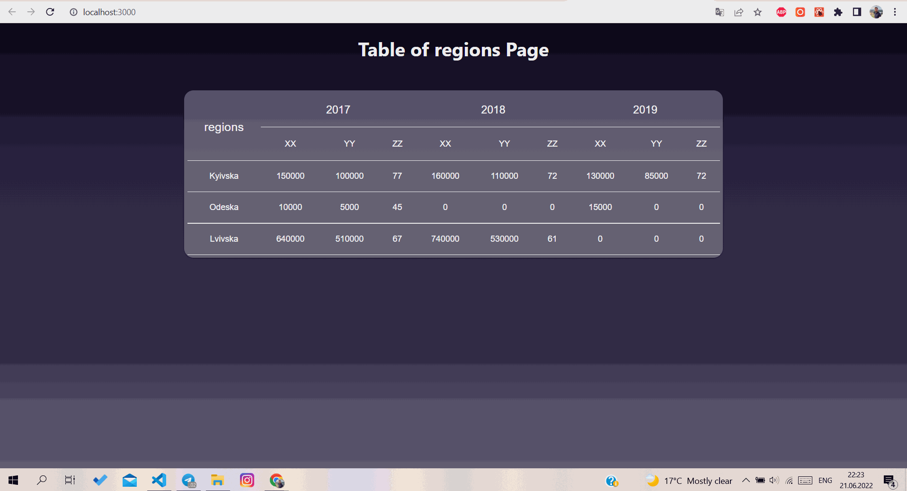

# Sierentz Test Task 

## Test task for creating a table and popup table with dynamically adding elements to the popup table with their rendering

In the project directory, you can run:

### `npm start`

## How the application works:

